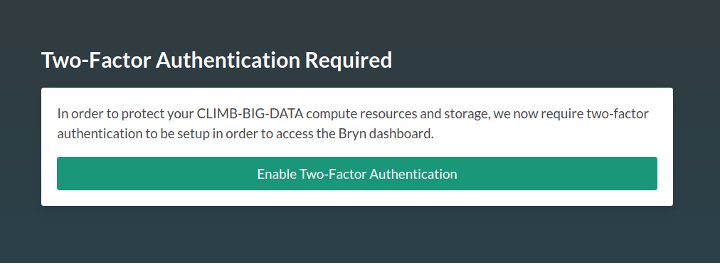
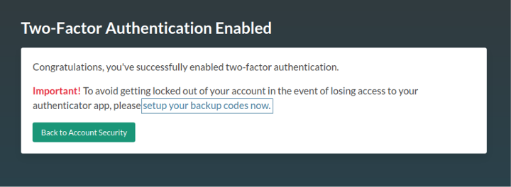
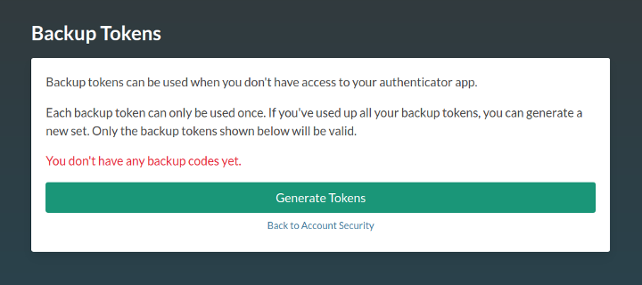
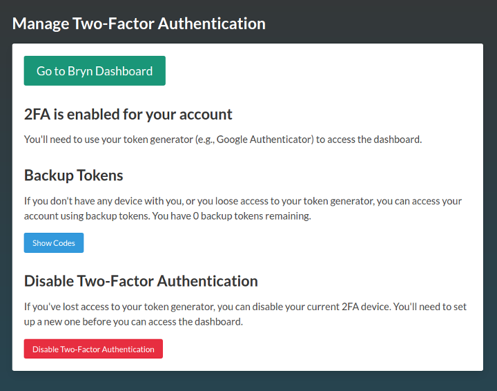
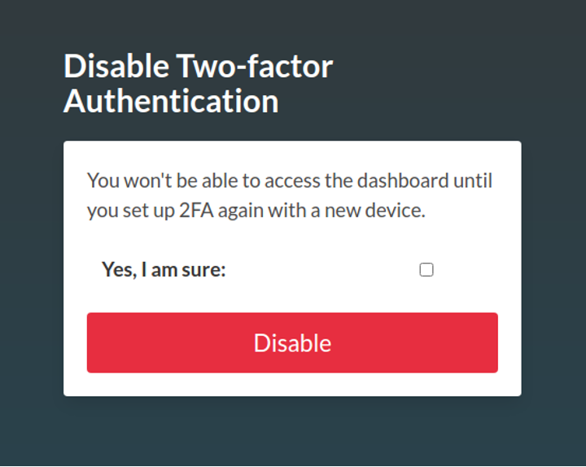

# Authentication

## Where do I sign in?

All CLIMB-BIG-DATA resources are accessed via the Bryn web interface.

You can login to Bryn at [https://bryn.climb.ac.uk/account/login/](https://bryn.climb.ac.uk/account/login/)

## Two-factor authentication

Two-factor authentication is mandatory, and users will be required to set this up on first login. This means that a code will be required from an authenticator app on a mobile or desktop device, in addition to your password.

For convenience, if using the same browser and device, you will only be required to enter this every 30 days.

### Initial setup

When you first login to your account, authentication will need to be set up. You will be presented with the following interface:

{ width=600 }

Hit enable and proceed to follow the instructions. You will be prompted to install an authenticator app on your mobile device. Our current recommendations (in order) are:

- [Authy](https://support.authy.com/hc/en-us/articles/115001945848-Downloading-and-Installing-Authy-Apps) (Desktop app available)
- [Microsoft Authenticator](https://www.microsoft.com/en-us/security/mobile-authenticator-app)
- [Google Authenticator](https://googleauthenticator.net/)

<!-- prettier-ignore -->
!!! info
    Authy and Microsoft Authenticator make it easier to backup and recover your codes in the case of loss or change of device, whereas Google requires a manual export/import.

    **Please do enable backups for your app at this stage, before you forget!**

### Authy backups

Authy has a backup feature to enable recovery in case you lose or replace your phone. Your data is encrypted and only decrypted on the devices using a password that only you will know.

See the [Authy documentation](https://authy.com/blog/how-the-authy-two-factor-backups-work/) for further details.

### Microsoft Authenticator backups

See the [Microsoft documentation](https://support.microsoft.com/en-us/account-billing/back-up-and-recover-account-credentials-in-the-authenticator-app-bb939936-7a8d-4e88-bc43-49bc1a700a40) for details on how to enable this.

### Scanning the QR code

In all authenticator apps, the default way to add an app is to scan a QR code. Bryn will present the code for you to scan, and ask you to enter the generated token before it expires (every 30s). If it does expire while you are typing, just enter the new one.

Congratulations, two-factor authentication is now enabled.

### Backup codes

You will now have the option to generate backup codes. This is a list of single-use codes that enable you to gain access in the event of the loss of your device. **This is strongly recommended**.

Follow the link to 'setup your backup codes' as seen in the screenshot below:

{ width=600 }

Next, hit the 'Generate tokens' button.

{ width=600 }

Print, save or otherwise make a note of these codes and keep them in a secure place.

You can now proceed to the [Bryn dashboard](https://bryn.climb.ac.uk/)

### Logging in to Bryn after 2FA is set up

When you next login to Bryn, after entering your username and password, a token will be requested from your 2FA device:

{ width=350 }

If you wish, mark the check box "Don't ask again on this device for 30 days"

### Using one of your backup tokens

If you don't have your device to hand, or you've lost it, you can use a single-use backup token.

To use a backup token, follow the link here:

{ width=350 }

### Managing two-factor authentication

When logged in to the Bryn dashboard, navigate to 'User profile' under the 'Team management' menu.

Here, you can view or generate your backup codes and disable 2FA (for example you wish to use a different device or app).

{ width=400 }

### Disable your current 2FA device (switch device or app)

If you wish to change your device or app, you'll need to disable your current two-factor authentication. This will log you out and restart the process.

Please note: if you are only changing device, the best option is to use the backup/recovery method for your authenticator app.

If you are sure you'd like to start again, hit the 'Disable Two-Factor Authentication' button.

{ width=400 }

Confirm you are sure, and you will be logged out. Log back in to restart the 2FA setup process with your new app or device.

### Frequently Asked Questions

#### I can no longer access my 2FA device or phone, and I can't recover from a backup

If you are still logged in to bryn, follow the steps in 2FA Management.

Otherwise, please contact our support team at [support@climb.ac.uk](mailto:support@climb.ac.uk)

#### Why are my authenticator codes not working ?

If you have setup your authentication but the 6-digit code does not work, you may need to check that the time on your device is set to auto-sync. Without this setting, the time on the device and server will not match and the codes will not work. This may be a term such as: "Use network provided time/time-zone".

#### Why are my backup codes not working ?

You will only have X backup codes to use. Once they have been used up, you will not be able to access your account. These are to be used when either the app/desktop authenticators do not work. You can check your codes and how many you have left, please see 2FA Management.

#### I have the authenticator app, why wont it let me scan anything ?

If you are not prompted to scan the QR code, you may need to change the permissions for the app to access your camera.

#### I don’t have a smart phone, how do I login ?

There are desktop versions of authenticators that you can use, such as Authy.
