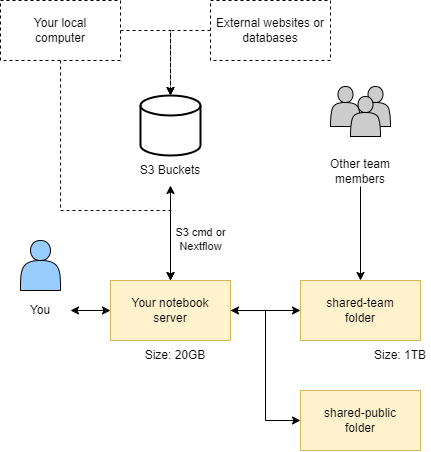

# How to transfer data between CLIMB-BIG-DATA and other systems

This section of the documentation will explain how to transfer data between CLIMB-BIG-DATA and other systems. It will cover the following topics:

* [Transferring from your local machine to and from your CLIMB-BIG-DATA notebook server](upload-to-notebook.md)
* [Transferring within your CLIMB-BIG-DATA notebook server (S3 to notebook)](fetch-s3-to-notebook.md)
* [Transferring from your local machine to the CLIMB-BIG-DATA S3 buckets](upload-local-to-s3.md)
* [Transferring programmatically between an S3 bucket and CLIMB-BIG-DATA notebook server (using python)](program-s3-fetch.md)

<!-- prettier-ignore -->
!!! tip
    For best performance, we recommend storing primary data (sequenced reads) on S3 buckets and pulling them down on demand for analysis. This can 
    be automated with workflow languages such as nextflow. 

If you are moving from an older CLIMB VM to the new notebook model, [you can read a dedicated guide here](transfer-from-vm-to-s3.md).

To first understand how to transfer data, it is important to understand how data is stored in CLIMB-BIG-DATA. This is covered in the next section.

## Understanding storage

Data in CLIMB-BIG-DATA can be found in four major locations:

* Your home directory `/home/jovyan` (~)
* A writable 'team share' mounted at `~/shared-team/` and linked to your home directory as `shared-team`
* Read-only shares mounted at `/shared/public` and linked to your home directory as `shared-public`
* S3 buckets

These interact with each other as shown in the diagram below:

### Home directory
The home directory `/home/jovyan` (~) is mounted to persistent storage for the CLIMB user, ensuring data retention after container restarts. It is small working directory location. Its intentional small size (usually 20GB) makes it unsuitable for large conda environments or databases. Alternative storage options are available. Additionally, the home directory serves as the default/base location for the file browser pane.
### Team share (shared-team)
A writable 'team share' is accessible at `/shared/team`, symlinked to your home directory as `shared-team` for easy file browsing. It offers significant storage space (1TB+ depending on tier) and grants all team members simultaneous read/write access. Additionally, it benefits from SSD-backed technology, ensuring exceptionally fast performance.
### S3 Buckets 
When using S3 buckets via Bryn, your access keys will be automatically injected into the notebook server as environment variables. The `aws cli` and `s3cmd` have been pre-configured to utilize the CLIMB S3 endpoints by default. This means you can access S3 buckets without any additional setup or configuration required.
###  Public shared (shared-public)
In addition to the team share, you may also notice additional mounts under `/shared/`, including at least `/shared/public`. Here you will find read-only data and resources provided by CLIMB, that may be useful to microbial bioinformatics workflows. Initially we have populated these shares with a few key resources:

- [Ben Langmead's Kraken2/Bracken Refseq Databases](https://benlangmead.github.io/aws-indexes/k2) - in `/shared/public/db/kraken2`
- [The NCBI GenBank non-redundant protein BLAST database](https://ftp.ncbi.nlm.nih.gov/blast/db/) - in `/shared/public/db/blast`

## What is an S3 bucket (Object storage)?
Object storage, implemented here as S3 buckets, is a way to store lots of data in a simple and flexible manner. Instead of organizing data into folders and files like on a computer, it treats each piece of data as a separate "object" with a unique name. These objects can be anything, like pictures, videos, or documents. Object storage is highly scalable, meaning it can handle a huge amount of data without slowing down. It also keeps copies of data to make sure it doesn't get lost. This type of storage is often used in cloud computing because it's cost-effective and easy to manage.

