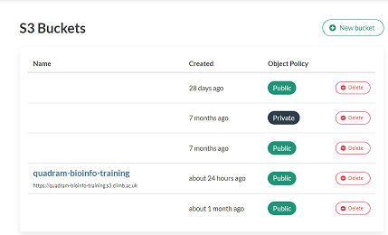
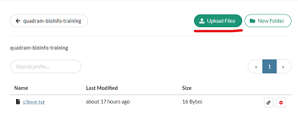
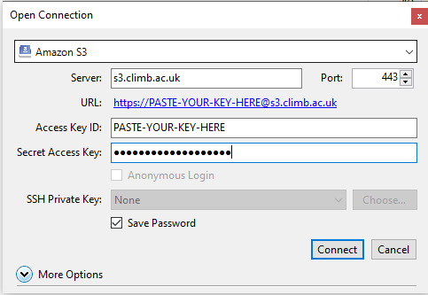
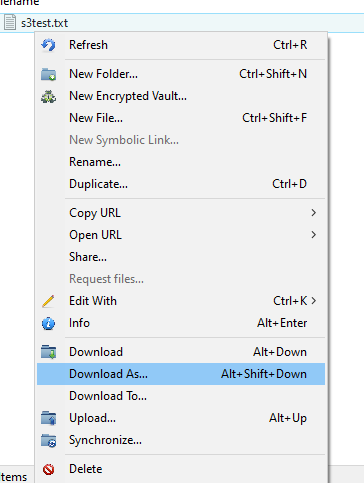

# Transferring from your local machine to the CLIMB-BIG-DATA S3 buckets

Transfer between your local machine to the S3 buckets can be done in a number of ways:

* [Using BRYN's web interface - for Windows, MacOSX and Linux](#using-bryns-web-interface)
* [Using a file transfer client (like cyberduck) - for Windows and MacOSX](#using-a-file-transfer-client)
* [Using the command line - for Windows, MacOSX and Linux](#using-s3cmd-on-the-command-line)

### Reminder; what are the S3 buckets?

S3 (Simple Storage Service) buckets are cloud storage containers provided by Amazon Web Services (AWS). They allow users to store and retrieve any amount of data securely, making it a scalable and cost-effective solution for storing various types of data, such as files, images, videos, backups, and application data. S3 buckets are highly durable and accessible over the internet, making them a popular choice for hosting static websites, data archiving, and serving as the backend for various cloud applications.

## Using BRYN's web interface

This option is available to all users, via the [BRYN](https://bryn.climb.ac.uk) web interface. First navigate to the section on S3 buckets, using the sidemenu:


You will then see a list of all the S3 buckets for your team. Click on the bucket you want to upload to.



This will should the contents of the bucket, and there are buttom in the top right to add files or folders to the bucket.



## Using a file transfer client

You can a number of file transfer client software to transfer files to the S3 buckets. You will require *API keys* to use such clients. These are availabe in the *S3 buckets* section of BRYN. Click on the *API keys* button to reveal your keys.


To demostrate, how to transfer files using a file transfer client, we will use [Cyberduck](https://cyberduck.io/). This is available for Windows and MacOSX. [Download and install the software](https://cyberduck.io/download/), and then open it. You will be presented with a window like this:


Click on the *Open Connection* button, and then select *Amazon S3* from the dropdown menu. You will then be presented with a window like this:



Enter the following details:

* **Server**: s3.climb.ac.uk
* **Access Key ID**: Your access key ID from BRYN
* **Secret Access Key**: Your secret access key from BRYN

Then click *Connect*. You will then be presented with a window of all the buckets, mirroring that in BRYN. Double click on the bucket you want to upload to, and you will see the contents of the bucket.

You can upload to the bucket using the upload button in the top left of the window. You can also drag and drop files and folders into the window to upload them.
You can right click on files and folders to download them.



For more information about cyberduck, see [here](https://docs.cyberduck.io/cyberduck/).

## Using s3cmd on the command line 

You can also use the command line to transfer files from your local machine to the S3 buckets. You will require *API keys* to use the command line. These are availabe in the *S3 buckets* section of BRYN. Click on the *API keys* button to reveal your keys.


<!-- prettier-ignore -->
!!! warning
    Remember, these are the steps required for you local machine, not the notebook server. The notebook server already has the `s3cmd` installed and configured.

To demostrate, how to transfer files using the command line, we will use [s3cmd](https://s3tools.org/s3cmd). This is available for Windows, Linux and MacOSX. [Download and install the software](https://s3tools.org/download). 

You can also install `s3cmd` using pip:

```bash
pip install s3cmd -U
```

Once `s3cmd` is installed, use the following command to configure it:

```bash
(s3cmd) ubuntu@eroll:~$ s3cmd --configure
```

It will then ask a series of questions. The answers are:


* **Access Key:** *Your access key, as displayed in BRYN (see above)*
* **Secret Key:** *Your access key, as displayed in BRYN (see above)*
* **S3 Endpoint:** s3.climb.ac.uk
* **DNS-style bucket+hostname:port template for accessing a bucket:** %(bucket)s.s3.climb.ac.uk

All other options just use the default values, listed in the square brackets [ ]. You can just press enter to accept the default values.

If we use s3cmd to list the buckets, we can see the buckets for our team:

```bash
(s3cmd) ubuntu@eroll:~$ s3cmd ls
2023-07-21 08:50  s3://quadram-bioinfo-training
```

Once this is configured correctly, s3cmd will behave the same as running it on the notebook server. There is more information on [how to use s3cmd here](fetch-s3-to-notebook.md).

This is the full configuration process, for reference. 

```bash
(s3cmd) ubuntu@eroll:~$ s3cmd --configure

Enter new values or accept defaults in brackets with Enter.
Refer to user manual for detailed description of all options.

Access key and Secret key are your identifiers for Amazon S3. Leave them empty for using the env variab
Access Key: XXXXXXXXXXXXX
Secret Key: XXXXXXXXXXXXX
Default Region [US]:

Use "s3.amazonaws.com" for S3 Endpoint and not modify it to the target Amazon S3.
S3 Endpoint [s3.amazonaws.com]: s3.climb.ac.uk

Use "%(bucket)s.s3.amazonaws.com" to the target Amazon S3. "%(bucket)s" and "%(location)s" vars can be
if the target S3 system supports dns based buckets.
DNS-style bucket+hostname:port template for accessing a bucket [%(bucket)s.s3.amazonaws.com]: %(bucket)s.s3.climb.ac.uk

Encryption password is used to protect your files from reading
by unauthorized persons while in transfer to S3
Encryption password:
Path to GPG program [/usr/bin/gpg]:

When using secure HTTPS protocol all communication with Amazon S3
servers is protected from 3rd party eavesdropping. This method is
slower than plain HTTP, and can only be proxied with Python 2.7 or newer
Use HTTPS protocol [Yes]:

On some networks all internet access must go through a HTTP proxy.
Try setting it here if you can't connect to S3 directly
HTTP Proxy server name:

New settings:
  Access Key: XXXXXXXXXX
  Secret Key: XXXXXXXXXX
  Default Region: US
  S3 Endpoint: s3.climb.ac.uk
  DNS-style bucket+hostname:port template for accessing a bucket: %(bucket)s.s3.climb.ac.uk
  Encryption password:
  Path to GPG program: /usr/bin/gpg
  Use HTTPS protocol: True
  HTTP Proxy server name:
  HTTP Proxy server port: 0

Test access with supplied credentials? [Y/n]
Please wait, attempting to list all buckets...
Success. Your access key and secret key worked fine :-)

Now verifying that encryption works...
Not configured. Never mind.

Save settings? [y/N] Y
Configuration saved to '/home/ubuntu/.s3cfg'
```